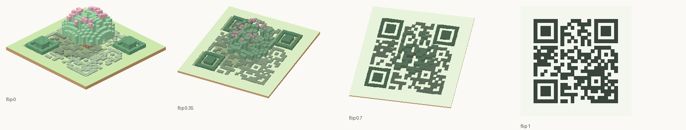
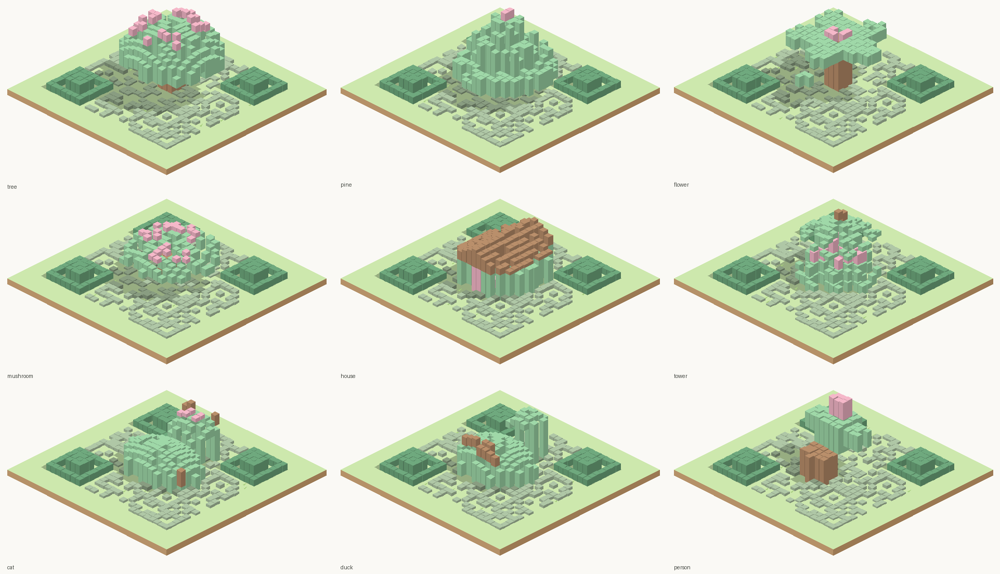
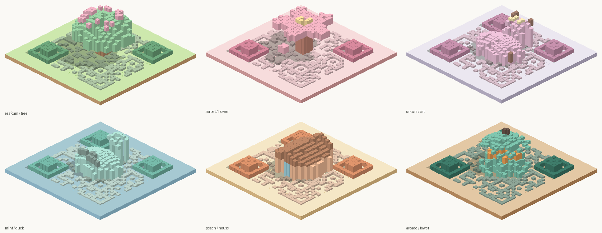
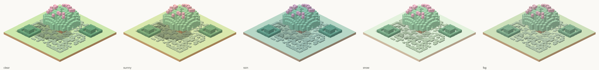

# Voxel QR

Type a link, a Wi-Fi login or a contact card. You get a pastel isometric diorama sitting on a
ground tile: a tree, a cat, a small house, a tower. Hover it on desktop or tap it on a phone and
the camera swings overhead while the blocks settle flat, and the same geometry resolves into a QR
code you can scan, save, or embed on a page.

No build step, no backend, no dependencies to install. It is a static site, so GitHub Pages hosts
it for free and the payload never leaves the browser.

## Why the geometry works



A scanner only cares about the pattern seen from directly above, which leaves the height axis
completely free. Every dark module in the code becomes a voxel column standing on the tile; every
light module stays bare ground. Sample a height profile of the chosen object at each dark-module
position and the columns pile up into a recognisable figure at the isometric angle, while the
column tops still spell out the exact code from overhead.

Shadows are solid by construction rather than ray traced. Each block's swept footprint is projected
onto the ground and rasterised to the module grid, so every shadow is a whole number of module-sized
squares in one flat tone. That gives the hard-edged look of flat illustration, costs one instanced
draw, and needs no shadow map to tune. Because the ground is mostly covered in low paving blocks, the
same mask also darkens any block short enough to be standing in shade, so the shadow reads as one
coherent pool rather than slivers between blocks.

Two classes of block keep that honest:

- Data blocks sit on the dark modules and are always present. Their heights and colours are free.
- Decor blocks are cosmetic voxels that complete the silhouette: a canopy overhang, a cat's ears,
  a roof ridge. They sit only on light modules, and during the flip they hop off the tile, so the
  top view is always a valid code rather than a code with something on top of it.

Dark modules that fall outside the object become a low mosaic apron, taller near the figure and
flattening into paving further out. The timing patterns become a stone path. The three finder
squares keep their exact geometry but read as hedges, because height and shade are free even where
the footprint is not.

Four things protect scanning: an orthographic camera in the top view, a four-module quiet zone
built into the tile, every colour tweening to a single dark ink as the blocks settle, and a flat
2D render of the same code fading in over the block tops once the camera lands. The 3D does the
show and the overlay does the work, so anything that scans an ordinary QR code scans this. You can
turn the overlay off if you want the blocks to do it alone.

## The interface

The scene owns the window. Three buttons in the top bar open three native `<dialog>` panels, which
means the focus trap, Escape to close and screen reader semantics come from the browser rather than
from hand-rolled ARIA:

- **Content** is a hamburger on the right of the bar, opening a vertical drawer from the right edge.
  Below 700px it takes the full screen.
- **Look** is a glass panel over the scene: a grid of icon tiles for Object, Ground, Colours,
  Background and Weather, each opening its own section. The panel is translucent with a backdrop
  blur, so the scene keeps changing visibly behind it while you pick. On a phone it becomes a bottom
  sheet.
- **Share** is separate from Look, because saving a code and restyling a scene are different jobs.
  It holds the PNG and SVG downloads, the scene capture, the share link, the embed snippet and
  Present mode.

The content fields change with the type rather than being one form with irrelevant boxes:

- **Link** is a single address bar.
- **Contact** is grouped into Name, Work, Reach, Address, Social and Note, with the last three
  collapsed until you have something in them. Socials take a handle or a full link and are written as
  `X-SOCIALPROFILE` lines.
- **Wi-Fi** is network name, encryption and password, and the password field disappears entirely when
  you pick an open network rather than sitting there greyed out.
- **Phone** switches between starting a call and starting a text, and the message box only appears
  for the second.

Every input carries the right `type`, `inputmode` and `autocomplete`, so phones raise the correct
keyboard and offer to fill in a name or a number. Fields are 16px, which is the threshold below which
iOS Safari zooms the page on focus.

## Turning the scene, and tapping it

Tap or click the scene to flip it. Hover does nothing, deliberately: a hover trigger cannot be
reached on a phone and fires by accident with a mouse.

Drag to orbit. Horizontal movement turns the scene, vertical movement tilts it, and the elevation is
clamped so you cannot go under the floor or straight overhead. A drag has to clear eight pixels
before it counts as a drag, which is what keeps a slightly sloppy tap from turning the scene instead
of flipping it. Arrow keys do the same thing from the keyboard, and the Look panel has a button to
put the angle back.

The angle rides in the shared config, so a link you send opens at the angle you chose.

The light is fixed in the world rather than pinned to the camera, so orbiting genuinely changes which
faces are lit and where the shadow falls, instead of dragging the lighting around with you.

## Weather

Five states: clear, sunny, rain, snow and fog. Each one moves several things at once rather than just
recolouring: key and ambient light, the light's colour, how strong the shadows are, whether there is
distance fog, and a tint applied to the blocks. Rain and snow add an instanced particle field, which
is positioned from the clock rather than accumulated per frame, so it cannot drift out of sync.

Object and ground are tinted by different amounts, which is both truer to life and load bearing: snow
whitens the ground far more than the sides of a tree. An earlier version tinted both equally and
flattened the object into its ground, which `tests/a11y.test.mjs` caught by checking every
weather, palette and ground combination. The legibility nudge is now applied after the weather tint
rather than before, so the two compose instead of fighting.

Everything stops for the scan view. Particles fade out, fog lifts, and the blocks settle still,
because a scanner wants a still, flat, high contrast target.

## Colours

Five colour slots are shared by every object, so every palette works with every object: `primary`
for the main mass, `secondary` for support, `accent` for highlights, `landmark` for the corner
markers, `scatter` for the loose blocks. Ground and background are separate, and each has ten
pastel presets plus a custom colour. Every well pairs the native colour input with a hex box, since a
colour wheel is hard to use precisely and impossible to use with a keyboard alone.

Background `None` makes the canvas transparent, which is what you want for an embed that should sit
on the host page's own colour.

Pastel on pastel can leave an object the same lightness as its ground. Rather than banning those
combinations, preset grounds are nudged a step away from the object colour until they separate, and
the test suite checks the result for every palette and ground pairing. A custom ground colour is
left exactly as you set it, because that is your call to make.

## Running it

Any static file server works, because the browser loads the ES modules directly.

```
python3 -m http.server 8000
```

Then open `http://localhost:8000`. Two files come from a CDN at runtime, three.js and GSAP. If
either fails to load the app still works: the flip falls back to its own requestAnimationFrame
tween, and if three.js is missing entirely the page shows the flat code and the exports still run.

## Tests

The QR encoder is written from scratch in `src/qr/encoder.js`, so it is tested rather than trusted.

```
npm test
```

That runs four suites with no dependencies:

- `tests/qr.test.mjs` decodes the output with an independently written decoder, round trips 400
  random payloads plus every byte length from 1 to 271, verifies each Reed-Solomon block by its
  syndromes, checks the free-module count per version against `codewords x 8 + remainder bits`, and
  compares format and version information against the published tables.
- `tests/sculpt.test.mjs` asserts the invariant the whole idea rests on: for every template, seed
  and version, the column footprint equals the dark-module set exactly, every module reaches the
  ground, nothing enters the quiet zone, and decor never lands on a dark module.
- `tests/app.test.mjs` covers payload building, config round trips, dice rolls and the SVG export.
- `tests/a11y.test.mjs` audits the interface: contrast ratios for every text pair and every
  background preset, that each control has a label tied by `for`, that hints are tied by
  `aria-describedby`, that tap targets reach 44px, that focus outlines exist and are never removed,
  that reduced motion and increased contrast are honoured, and that the responsive breakpoints and
  grid tracks are what they claim to be.

The module-count check is worth keeping. It caught two real bugs during the build: a Reed-Solomon
generator polynomial built in the wrong coefficient order, and alignment patterns whose centre sits
on the timing row being skipped, which silently broke versions 7 through 10.

## Looking at scenes without a browser

Nine objects ship with it, all encoding the same link:



Six palettes, each shown on a different object and ground:



Five weather states, the same scene each time. Rain is deliberately blue and bright rather than
grey and hazy, and fog is the only state that switches on distance fog:



Those sheets are generated, not screenshotted. `tools/preview.mjs` runs the real sculptor and emits
isometric polygons, and `tools/sheet.py` rasterises them into a labelled contact sheet. Useful for
judging a new object template before touching the renderer.

```
node tools/preview.mjs templates
python3 tools/sheet.py preview.json templates.png 3 1.6
```

Modes are `templates`, `palettes`, `weather` and `flip`.

## Hosting on GitHub Pages

Push the repository and turn on Pages with the GitHub Actions source. The included workflow runs
the tests, builds the single-file bundle, and publishes the repository root. Nothing needs a base
path because every reference in the HTML is relative.

## Embedding

`Copy a link to share` points at `view.html`, not at the editor. Whoever opens it gets the scene and
nothing else: no bar, no panels, no way to edit your content. It starts as the diorama and flips on
tap, exactly like the embed. `embed.html` is the same viewer sized for an iframe with a transparent
background.

`Copy the embed code` and `Copy a link to share` both write to the clipboard and also drop the text into a
selectable box under the buttons, with a confirmation toast either way. That belt and braces exists
because `navigator.clipboard` only works in a secure context, so serving the site over plain HTTP on
a LAN address makes a silent clipboard write impossible. The box means the text is always reachable.

The embed snippet points at `embed.html`, with the whole scene compressed into the URL hash:

```html
<iframe src="https://you.github.io/voxel-qr/embed.html#c=..."
        width="320" height="360" loading="lazy" style="border:0"
        title="Scan this code"></iframe>
```

The embedded scene idles and flips on hover or tap like the real thing. Because the config rides in
the hash it is never sent in an HTTP request, so a contact card in an embed link stays between the
page and the visitor.

`dist/voxel-qr.html` is the same app as one self-contained file, built by `npm run bundle`. Handy for
dropping into a wiki or mailing to someone. One difference from the multi-file site: the bundle
imports three.js at the top level rather than lazily, so it needs that CDN request to succeed. The
deployed site keeps the lazy import and falls back to the flat code without it.

## Adding an object

An object template is a function over its own bounding circle. `nx` and `ny` run from -1 to 1, and
heights are fractions of the object's diameter, so a template keeps its proportions at any code
density. Return an array of column segments, since one module can carry both a wall and the roof
above it.

```js
const lamp = {
  id: 'lamp',
  name: 'Lamp post',
  reach: 0.18,
  fill: 0.8,
  sample(nx, ny) {
    const post = Math.abs(nx) < 0.3 && Math.abs(ny) < 0.3;
    if (!post) return [];
    return [
      { base: 0, top: 1.1, slot: 'secondary' },
      { base: 1.1, top: 1.3, slot: 'accent' },
    ];
  },
  decor(nx, ny) {
    if (Math.abs(nx) < 0.3 && Math.abs(ny) < 0.3) {
      return [{ base: 0, top: 1.08, slot: 'secondary', keep: true }];
    }
    return [];
  },
};
```

`reach` is the object radius as a fraction of the code width, so 0.18 gives a footprint about a
third of the tile. `fill` is how much of the decor survives a seeded thinning pass, which is what
keeps the figure looking built out of the code rather than moulded on top of it. A part marked
`keep` skips the thinning, for structure you always want: a trunk, a pair of ears, a beak.

Colours come from five slots shared by every template, so every palette works with every object:
`primary` for the main mass, `secondary` for support, `accent` for highlights, `landmark` for the
corner markers, and `scatter` for the loose blocks.

## Checking it in a browser

The suite above catches what static analysis can catch. Four things need a real browser, and this is
the shortest path through them in Chrome DevTools:

1. **Layout, at three widths.** Toggle the device toolbar, then check 390px, 768px and 1440px. Watch
   the content drawer going full screen and the glass panel becoming a bottom sheet at 700px, and the
   fields going single column at 560px. Open and close each panel at each width and confirm the
   canvas resizes rather than stretching.
2. **Contrast and labels, automatically.** Lighthouse, accessibility category only. Then in the
   Elements panel open the Accessibility pane and walk the form to confirm every input reports its
   own name. Rendering panel has emulators for `prefers-reduced-motion` and `prefers-contrast`.
3. **Keyboard only.** Put the mouse down. Tab from the skip link through the drawers, the type tabs
   (arrow keys should move between them), the fields, the choice groups (arrow keys again) and the
   export buttons. The focus ring should be visible at every stop, including on the scene itself.
4. **Touch, gestures and performance.** With touch emulation on, tap the scene to flip it, then drag
   to orbit, and check that a slightly sloppy tap still flips rather than turning. Then record a
   Performance trace during a flip in rain at 4x CPU throttling: that is the worst case, since the
   flip writes a transform for every block each frame while the particle field writes its own.

The one thing worth doing before any of that: put a phone camera on the scan view and check it
actually scans.

## Two traps in this layout

Both of these cost real debugging time, so they are worth knowing before you touch the stylesheet.

**A closed `<dialog>` is hidden by a browser rule, and any author rule setting `display` beats it.**
Setting `display: grid` on a dialog class makes every panel permanently visible, never modal, with a
close button that appears to do nothing because the element was never open in the first place. The
stylesheet now carries `dialog:not([open]) { display: none }` and scopes the grid to `[open]`, and
`tests/a11y.test.mjs` asserts that no dialog class sets `display` unconditionally.

**The bar height is not a constant.** An earlier version sized the scene with
`calc(100dvh - 60px)`, which breaks the moment the bar wraps. The body is now a two row grid, so the
bar takes what it needs and the scene takes the rest. That is what lets the buttons keep their text
labels at every width instead of collapsing to bare icons.

## A note on scroll containers

Every panel is a grid with a fixed header and one scrolling body, and the body carries both
`overflow-y: auto` and `min-height: 0`. The `min-height` is the part that matters: without it a grid
item refuses to shrink below its content, the body grows instead of scrolling, and anything at the
bottom of a long form becomes unreachable. That exact bug hid the collapsed Address and Social
sections in an earlier version. Worth knowing before you restyle those rules.

## Known limits

Versions 1 to 10 are supported, which tops out at 271 bytes at error correction level L. A full
vCard with name, organisation, role, phone, email, website and city lands around version 9 or 10,
which works but makes the blocks small. When a payload does not fit, the app eases the error
correction level one step at a time and says so in the density line, and trims only as a last
resort. Extending the block tables past version 10 is the fix if you need longer payloads.

Pastel is by definition low contrast, so the iso view is soft and the scan view is not. Colours
converge on the palette's ink during the flip, and `tests/sculpt.test.mjs` checks every palette
against a contrast threshold, but a custom colour picked in the wells is your own to judge.

The glass Look panel needs `backdrop-filter`. Without it the panel falls back to nearly opaque, which
loses the point of seeing the scene change behind it but stays perfectly usable. Under
`prefers-contrast: more` the blur is dropped on purpose.

Rotation is free in azimuth but clamped in elevation, and there is no zoom. The framing is computed
from the scene bounds every frame, so a zoom control would need that fit logic to take a scale factor.
`SHADOW_LIGHT` and `KEY_DIRECTION` in `src/render/shadows.js` are the two constants that set where
the light comes from; they are meant to stay opposite each other.
